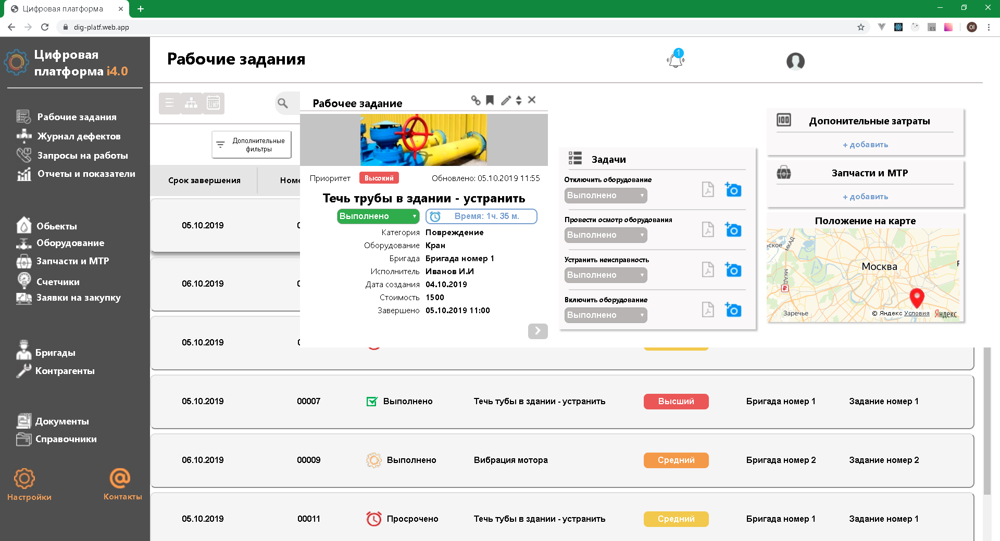

## Digital platform
### Example HTML-coding React application

In the project directory, you can run:

#### `npm start`

Runs the app in the development mode. 
Open [http://localhost:3000](http://localhost:3000) to view it in the browser.
   

Or link:   
https://dig-platf-1b95c.web.app/ 

  

